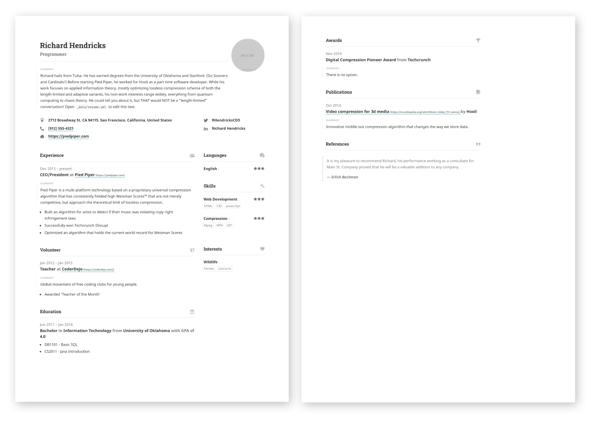

# Portfolio
{:.center-image width="300" height="300" loading="lazy"}
강아지 이름은 '단지' 이다. 이쁜짓 할 땐 꿀단지, 미운짓 할 땐 애물단지
{:.figcaption}
# Lee, Younseo
**오늘보다 더 나은 내일을 추구하는 공대생, 이윤서입니다.** 기계공학부 재학하며 로봇제어, ROS, 머신러닝등에 관심이 있습니다. 돈도 많이 벌고 싶고, 공부도 많이 하고 싶습니다. 단순 개발자는 하고 싶지 않습니다. 개발하는 사업가가 되고 싶습니다. 많은 경험을 하고 싶습니다. 50살에는 산이 올려다 보이는 목공까페를 운영하며 커피 한 잔하며 목공을 가르치고 싶습니다.  
ENFP 와 ENTP 그 사이 어딘가 입니다. 

## Personal Info

**E-mail** &nbsp;&nbsp;&nbsp; leejimmy0407@gmail.com  
**거주지** &nbsp;&nbsp;&nbsp; 서울시 강동구

## 2022

- YEHS 운영진 기획 1부 차장
- 카투사 전역
    - 42A
    - 그 뭐시기 평택시민 뉴스 링크
    - 시니어 카투사 응애
    - 모범카투사
    - 패스 만드는 거

## 2021

- 군 복무

## 2020

- 삼성드림클래스 겨울방학 한양대캠프
- 방구석 메이커톤 금상
- 창의적 종합설계경진대회 2등
- YEHS 메이커톤 1등
- 카투사 입대

## 2019

- 성균관대학교 공학계열 입학
- SIOR
    - 사이어 소개
    - 전시회 자전거
- YEHS 입단
    - YEHS 소개

## 2018

- 과학탐구보고서대회(전향력을 이요한 양궁 뭐시기)
    - 국가대표 코치 연락
- 물리 논술대회 금상?

## 2017

- 현대청운고 GLS 프로그램 2등
    - 미국 캘리포니아 공학 기행 계획서
    - 지도
    - 사진
    - 느낀점
    - 책 발행(링크)
- 과학 탐구보고서 대회 은상(컴퓨터 팬 속도, 온도, 소음 그런거 상관관계)
- 전국 과학 전람회 입상(돌림힘을 이용한 건물 풍진동 감쇠 장치)
- 물리 논술 대회 은상

## 2016

- 대현중학교 졸업
- 현대청운고 입학
- 과학 탐구 보고서대회 동상
- 35대 부회장


으아
{:.lead}

1. this list will be replaced by the toc
{:toc .large-only}

{:.lead width="1920" height="1080" loading="lazy"}

Hydejack's cover page on a variety of screen sizes.
{:.figcaption}


**Hydejack** is a boutique Jekyll theme for hackers, nerds, and academics, with a focus on personal sites that are meant to impress. 

It includes a blog that is suitable for both prose and technical documentation, a portfolio to showcase your projects, and a resume template that looks amazing on the web and in print.

> Your complete presence on the web — A [blog], [portfolio], and [resume].
{:.lead}


## A Personal Site That Won't Disappear

**Hydejack** is 100% built on Open Source software, and is Open Source itself, save for parts of the PRO version. The PRO version is a one-time payment that gives you the right to use it forever.

Hydejack is all static sites. _HTML_. All you need is a web server --- any web server --- to have a professional web presence that lasts a lifetime.

## Download




## A Free Blogging Theme
**Hydejack** started out as a free blogging theme for Jekyll — and continues to be so.

<!--posts-->


## An Impressive Portfolio
A portfolio that's guaranteed to be impressive — no matter what you put into it.

<!--projects-->


## A Printable Resume
Get a resume that's consistent across the board — whether it's on the web, mobile, print, or [PDF](assets/Resume.pdf).

[{:.lead width="884" height="632" loading="lazy"}][resume]{:.no-hover.no-mark}

Front and center page of a print resume generated by Hydejack.
{:.figcaption}


## Just Markdown
Write all content with Markdown. __Hydejack__ gives you [additional CSS classes](docs/writing.md) to stylize your content, without losing compatibility with other Jekyll themes.


## Just Markup
**Hydejack** boasts a plethora of modern JavaScript, but make no mistake: It's still a _plain old web page_ at its core. It works without JavaScript and you can even view it in a text-based browser like `w3m`:

{:.tail width="1920" height="1260" loading="lazy"}

The Hydejack blog, as seen by the text browser `w3m`.
{:.figcaption}


## Syntax Highlighting
**Hydejack** features syntax highlighting, powered by [Rouge].

```html
<!-- file: `_includes/my-body.html` -->
<script type="module">
  document.querySelector("hy-push-state").addEventListener("hy-push-state-load", () => {
    const supportsCodeHighlights = false; // TBD!!
  });
</script>
```

Code blocks can have a filename and a caption.
{:.figcaption}


## Beautiful Math
They say math is beautiful — and with **Hydejack**'s [math support][math] it's guaranteed to also look beautiful:

$$
\begin{aligned}
  \phi(x,y) &= \phi \left(\sum_{i=1}^n x_ie_i, \sum_{j=1}^n y_je_j \right) \\[2em]
            &= \sum_{i=1}^n \sum_{j=1}^n x_i y_j \phi(e_i, e_j)            \\[2em]
            &= (x_1, \ldots, x_n)
               \left(\begin{array}{ccc}
                 \phi(e_1, e_1)  & \cdots & \phi(e_1, e_n) \\
                 \vdots          & \ddots & \vdots         \\
                 \phi(e_n, e_1)  & \cdots & \phi(e_n, e_n)
               \end{array}\right)
               \left(\begin{array}{c}
                 y_1    \\
                 \vdots \\
                 y_n
               \end{array}\right)
\end{aligned}
$$

Hydejack uses KaTeX to efficiently render math.
{:.figcaption}


## Build an Audience
The PRO version has built-in support for customizable [Tinyletter] newsletter subscription boxes.

If you are using a different service like MailChimp, you can build a custom newsletter subscription box using [Custom Forms][forms].


## Features




## Comparison




## Get It Now

Use the the form below to purchase Hydejack PRO:

<div class="gumroad-product-embed" data-gumroad-product-id="nuOluY"><a href="https://gumroad.com/l/nuOluY">Loading…</a></div>


[blog]: /
[portfolio]: https://hydejack.com/examples/
[resume]: https://hydejack.com/resume/
[download]: https://hydejack.com/download/
[welcome]: https://hydejack.com/
[forms]: https://hydejack.com/forms-by-example/

[features]: #features
[news]: #build-an-audience
[syntax]: syntax-highlighting
[latex]: #beautiful-math
[dark]: https://hydejack.com/blog/hydejack/2018-09-01-introducing-dark-mode/
[search]: https://hydejack.com/#_search-input
[grid]: https://hydejack.com/blog/hydejack/

[lic]: LICENSE.md
[pro]: licenses/PRO.md
[docs]: docs/README.md
[ofln]: docs/advanced.md#enabling-offline-support
[math]: docs/writing.md#adding-math

[kit]: https://github.com/hydecorp/hydejack-starter-kit/releases
[src]: https://github.com/hydecorp/hydejack
[gem]: https://rubygems.org/gems/jekyll-theme-hydejack
[buy]: https://gum.co/nuOluY

[gpss]: https://developers.google.com/speed/pagespeed/insights/?url=https%3A%2F%2Fhydejack.com%2Fdocs%2F
[rouge]: http://rouge.jneen.net
[katex]: https://khan.github.io/KaTeX/
[mathjax]: https://www.mathjax.org/
[tinyletter]: https://tinyletter.com/
